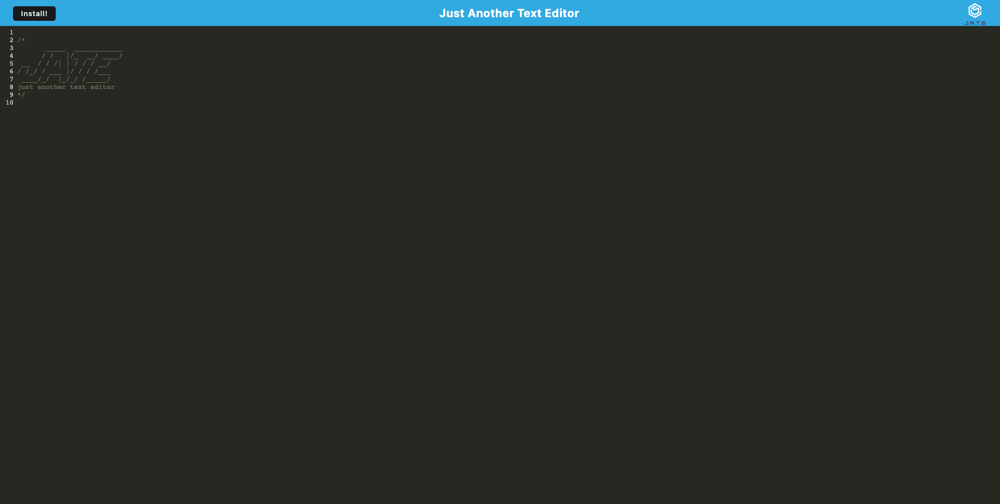

# Text Editor

## Description

JATE is a text editor that runs in the browser. Its a single page application that meets the PWA criteria. It could be useful for developers to create notes or code snippets with or without internet connection so that they could reliably retrieve them for later use.

## Table of Contents

- [Installation](#installation)
- [Usage](#usage)
- [Technologies used](#technologies-used)
- [License](#license)
- [Deployed_Link](#deployed-link)

## Installation

This program can be run through a browser using the link to the the deployed application. Alternatively, to run this application locally you will need to:

- Clone this repository to receive all of the files.

- Run "npm install" in the command line of your terminal to set up all of the dependencies.

- Run "npm start" to start the backend and serve the client.

- Go to the url of the application (http//:localhost:3000) to begin using it.

## Usage

Use the deployed URL to open the deployed application.

Type any code snippet or notes in the editor. The content will be saved in the IndexedDB when the window is unfocused. When you reopen the text editor after closing it, the content in the text editor will be retrieved from the IndexedDB.

If the Install button is clicked, the web application will be downloaded as an icon in your desktop.

The application works without an internet connection.

## Technologies used

Node.js, Express.js, IndexedDB, PWA, Heroku

## License

Text Editor is available under the MIT License.

## Deployed Link

